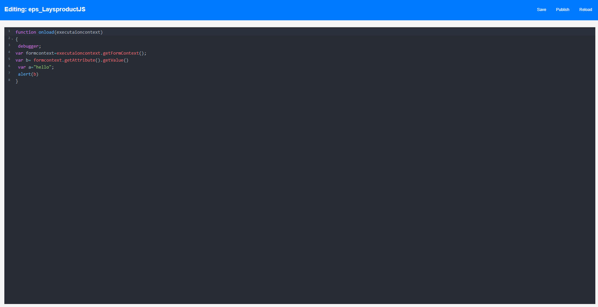

# Dataverse Web Resource Editor - Chrome Extension

This Chrome extension provides a quick and efficient way to manage and edit Web resources in Dataverse. The extension allows users to view, edit, and publish web resources directly from their browser without navigating through multiple screens in the Dynamics 365 interface.

## Features

- **List Web Resources**: Lists all web resources associated with a solution.
- **Inline Editing**: Directly edit the content of a web resource (Example: JavaScript or HTML) within the extension.
- **Save and Publish**: Save changes to the web resource and publish them instantly without having to open the full Dynamics 365 interface.
- **Solution-Based Management**: Browse and edit web resources across multiple solutions in Dynamics 365.
- **Search Functionality**: Quickly find web resources across different solutions by name or part of the script content.

## How to Install

1. Download the latest release Zip file
3. Open Chrome and navigate to `chrome://extensions/`.
4. Enable **Developer mode** using the toggle in the upper-right corner.
5. Click **Load unpacked** and select the folder where the extension is located.
6. The extension will now be installed and visible in your Chrome toolbar.

## How to Use

1. Open your Dynamics 365 CRM in the browser.
2. Click the Dataverse Web Resource Editor icon in the Chrome toolbar.
3. The extension will display a list of all available solutions. Use the search functionality to find the desired solution and click on it.
4. Select the web resource you wish to edit.
5. Click **Open in Editor** to open the editor and modify the content of the web resource.
6. Once you have made your changes, click **Save** and then **Publish** to apply the updates directly to Dynamics 365.

## Screenshots

Main Screen

Web Resource Editor

## Notes

- The extension requires the correct permissions to interact with Dynamics 365 environments. Ensure that your browser session has proper access to the Dynamics 365 instance.
- Large web resources might take a few seconds to load in the editor.

## Future Enhancements

- **Version Control Integration**: Add support for GitHub or other version control systems to track changes to web resources.
- **Support for Other Resource Types**: Extend functionality to handle images, XML, and other resource types.
- **Offline Editing**: Allow users to edit resources offline and sync changes once back online.
- **Save and load from Local Copy**: Save the web resource to a local copy and load it back into the editor.

## Contributing

If you'd like to contribute to this project, feel free to fork the repository and submit a pull request. You can also open issues if you encounter any bugs or have suggestions for new features.

## License

This project is licensed under the MIT License - see the [LICENSE](LICENSE) file for details.
